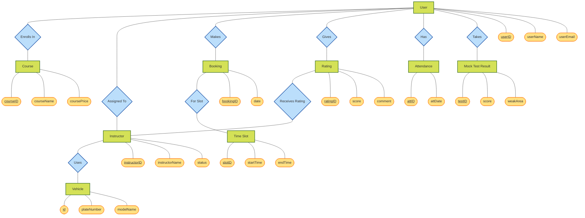

# Chen-Style Entity-Relationship Diagram

Here is the updated Entity-Relationship diagram designed with the classic Chen notation style (Entities as rectangles, Relationships as diamonds, Attributes as ovals, and Primary Keys underlined).

